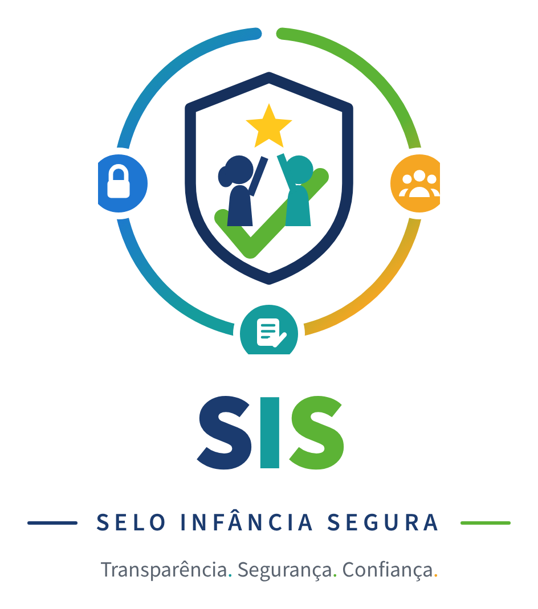

<div align="center">



### Selo Infância Segura

**Certificação de instituições que atendem crianças e adolescentes,
com histórico público e auditável.**

</div>

---

## O problema

Quando uma família escolhe uma escola, creche, clínica, clube ou parque de diversões, ela decide praticamente no escuro. Não existe hoje uma forma padronizada e confiável de verificar se aquele lugar oferece um ambiente seguro e adequado ao público infantojuvenil.

O problema tem três lados:

| Quem                             | Dor                                                                             |
| :------------------------------- | :------------------------------------------------------------------------------ |
| **Famílias**                     | Precisam confiar sem ter informação suficiente.                                 |
| **Instituições sérias**          | Investem em qualidade, mas não conseguem demonstrar isso de forma transparente. |
| **Prefeituras e redes privadas** | Precisam fiscalizar dezenas ou centenas de unidades com recursos limitados.     |

## A solução

Uma plataforma de certificação. Profissionais credenciados — psicólogos, pedagogos — avaliam a instituição segundo critérios ancorados em normas que já existem: ECA, LGPD, LBI, Vigilância Sanitária, Corpo de Bombeiros e recomendações da UNICEF.

A avaliação percorre **seis eixos**:

| Eixo                           | Base normativa             |
| :----------------------------- | :------------------------- |
| Ambiente seguro e saudável     | ECA · Vigilância Sanitária |
| Segurança predial e prevenção  | Corpo de Bombeiros         |
| Acessibilidade e inclusão      | LBI · Recomendações UNICEF |
| Qualificação dos profissionais | ECA · Conselhos de classe  |
| Proteção de dados de menores   | LGPD                       |
| Canais de escuta e denúncia    | ECA · Conselho Tutelar     |

A pontuação resultante define o nível do selo. A escala é progressiva de propósito: o objetivo não é aprovar ou reprovar, é incentivar evolução contínua.

Duas réguas, não uma: além da média ponderada, **nenhum eixo pode ficar abaixo do piso eliminatório** (60 pontos nos modelos publicados). Média alta não compensa um eixo em ruína — uma escola com acessibilidade zerada e todo o resto impecável continua sendo uma escola que exclui criança com deficiência.

<div align="center">
&nbsp;&nbsp;
&nbsp;&nbsp;

</div>

- **Bronze** · da nota de corte até 74 pontos — requisitos essenciais atendidos, com plano de adequação ativo.
- **Prata** · 75 a 89 pontos — boas práticas consolidadas em todos os eixos.
- **Ouro** · 90 a 100 pontos — referência em proteção integral, com escuta ativa e acompanhamento contínuo.

A nota de corte não é a mesma para todo ambiente: cada **modelo de selo** define a própria (60 na educação básica, 65 em saúde e terapias). O token da certificação carrega a sigla e a versão do modelo aplicado — `SIS-EB-2026-0004` —, porque auditar uma emissão anos depois exige saber sob qual régua ela foi feita.

Além do selo principal, a instituição pode conquistar **subselos** por práticas específicas: Acessibilidade, Inclusão TEA, Prevenção ao Bullying e Segurança Digital.

Cada certificação **vale 12 meses** e exige nova avaliação para ser renovada — o padrão precisa se sustentar no tempo, não apenas no dia da vistoria. O portal acompanha esse prazo: selo a menos de 90 dias do vencimento entra na fila de renovações da rede e do SIS.

O resultado fica em um **portal público**, onde responsáveis consultam o histórico de certificação antes de decidir. O portal também abre um **canal de denúncia anônima**, transformando a fiscalização em algo permanente.

> [!NOTE]
> **Denúncia entra na cadeia no envio; na vitrine pública, nunca.** O bloco é gravado no momento em que o relato chega, com hash próprio, e o denunciante recebe o protocolo na hora. A apuração corre no portal institucional — é lá que a instituição acompanha cada etapa e o SIS decide. A ficha pública não exibe denúncia em nenhum estágio, nem depois da triagem: relato é alegação, e uma acusação em vitrine derruba a reputação de quem talvez não tenha feito nada, o que transformaria o canal de escuta em instrumento de ataque de imagem. O que chega ao cidadão é a decisão — inclusive a **suspensão do selo**, que aparece na ficha sem citar o protocolo que a originou.

## Por que blockchain

Um banco de dados tradicional pode ser corrigido sem deixar rastro. É justamente o rastro que dá valor a um selo de segurança infantil.

Registrando cada avaliação, emissão, renovação e denúncia em blockchain, o histórico se torna **permanente e auditável**: nada é alterado sem evidência. Isso reduz fraude, sustenta a confiança de quem consulta o selo e garante que uma denúncia anônima fique registrada de forma verificável pelo próprio denunciante.

## Público-alvo

Instituições públicas e privadas com várias unidades sob responsabilidade. O caso típico: uma prefeitura contrata a plataforma para que suas escolas conveniadas se certifiquem. A prefeitura ganha visibilidade e métricas da rede inteira, incluindo alertas de situações de risco; as escolas ganham histórico e um diferencial reputacional.

> [!NOTE]
> **Sobre o modelo jurídico.** Nenhuma lei brasileira obriga a contratar certificação, e não existe selo de proteção infantil obrigatório. A legislação cria dever de **agir e comunicar**, não dever de comprar. A plataforma é uma forma de cumprir e comprovar esse dever — não a única. Existem incentivos concretos que tornam a contratação atrativa (responsabilidade pessoal por omissão no art. 245 do ECA, financiamento via FIA/CMDCA, responsabilidade do município sobre a rede conveniada), mas **todos precisam de validação com advogado antes de virar argumento oficial.**

## Status

Protótipo navegável de alta fidelidade — a camada de interface e o fluxo completo do produto.

> [!IMPORTANT]
> **Não há backend, autenticação real nem blockchain conectada.** Todos os dados vêm de `src/lib/mock-data.ts`. O login apenas seleciona qual recorte de dados a interface exibe: não há hash de senha nem sessão de servidor. Redes, municípios e instituições são fictícios de propósito — atribuir um selo, mesmo fictício, a uma prefeitura real seria afirmar sobre ela algo que o projeto não pode sustentar.

Duas escolhas de protótipo que valem explicação:

- **A data de "hoje" é congelada** em `DATA_DE_REFERENCIA` (28/07/2026). Prazos e vencimentos precisam de um agora, e usar o relógio real faria a demonstração envelhecer sozinha: um mês depois, metade dos prazos apareceria vencida sem ninguém ter mexido em nada.
- **Emitir um selo repercute de verdade.** Atribuir uma certificação em `/portal/modelos` ou `/portal/certificacoes` grava no `localStorage`, e a partir daí a instituição aparece certificada na consulta pública, na ficha, nos indicadores e na cadeia — como apareceria em produção. Uma emissão que só a própria tela enxerga ensinaria errado sobre o produto.

Próximos passos: validar juridicamente o modelo, desenvolver o MVP e rodar um piloto em um município de pequeno ou médio porte.

---

## Rodando localmente

O projeto usa [Bun](https://bun.sh) (`bun.lock` + `bunfig.toml`), mas npm também funciona — há um `package-lock.json` mantido em paralelo.

```sh
git clone https://github.com/Filipe-glitch/yc-chain-safe.git
cd yc-chain-safe
bun install     # ou: npm ci
bun run dev     # ou: npm run dev
```

| Script            | O que faz                            |
| :---------------- | :----------------------------------- |
| `bun run dev`     | Servidor de desenvolvimento com HMR. |
| `bun run build`   | Build de produção em `.output/`.     |
| `bun run preview` | Serve o build de produção.           |
| `bun run lint`    | ESLint.                              |
| `bun run format`  | Prettier.                            |

### Contas de demonstração

Senha única para todas: **`demo1234`**. São estáticas e existem para que quem avalia o projeto entre em cada portal sem cadastro.

| Perfil                  | E-mail                                            | O que enxerga                                                                               |
| :---------------------- | :------------------------------------------------ | :------------------------------------------------------------------------------------------ |
| **Administração SIS**   | `admin@demo.selo-infancia-segura.org`             | Todos os clientes: emite certificação, credencia avaliadores, responde a fila de denúncias. |
| **Instituição gestora** | `rede@demo.selo-infancia-segura.org`              | Consolidado das suas unidades e controle de quem tem acesso ao portal.                      |
| **Unidade**             | `serraverdecentral@demo.selo-infancia-segura.org` | Própria certificação, plano de adequação e denúncias que lhe dizem respeito.                |

## Stack

**TanStack Start** (SSR sobre Vite e Nitro) · **React 19** · **TypeScript** · **Tailwind CSS v4** · **shadcn/ui** sobre Radix · **Recharts** · **Zod** + React Hook Form

A configuração do Vite vem de `@lovable.dev/vite-tanstack-config`, que já inclui os plugins do TanStack, Tailwind, path aliases e injeção de env. Não adicione esses plugins manualmente em `vite.config.ts` — duplicá-los quebra a aplicação.

## Estrutura

```
src/
├── routes/                 Rotas (file-based routing do TanStack)
│   ├── index.tsx           Landing page
│   ├── cidadao.*           Portal público: consulta, ficha da instituição, denúncia
│   └── portal.*            Portal interno: dashboard, certificações, auditorias,
│                           avaliadores, denúncias, registros, relatórios, plano, acessos
├── components/
│   ├── ui/                 Primitivos shadcn/ui
│   ├── Brand.tsx           Identidade visual (logo, marca)
│   ├── Seal.tsx            Renderização de selos e níveis
│   ├── PortalLayout.tsx    Casca do portal interno
│   └── illustrations/      Ilustrações da landing
├── lib/
│   ├── mock-data.ts        Fonte única de dados e das regras de apuração
│   ├── certificacoes-store.tsx  Catálogo de modelos e emissões da sessão
│   ├── selo-efetivo.tsx    Leitura de selo/nota/validade, com as emissões aplicadas
│   ├── portal-access.ts    Perfis de acesso: admin, rede, unidade
│   └── portal-session.tsx  Sessão do lado do cliente
└── styles.css              Tema, tokens e tipografia

public/
├── marca/                  Logos e emblemas
└── selos/                  Artes dos selos (nível e subselos)
```

As rotas do portal seguem o ciclo de vida da certificação: **avaliação → emissão → renovação**, com denúncias e registros atravessando todas as etapas.

A regra que sustenta a consistência: **nada é escrito duas vezes.** `mock-data.ts` guarda apenas as notas por eixo e o modelo aplicado; pontuação, nível, validade, token, certificação, avaliação e bloco na cadeia são todos derivados disso. Nenhuma instituição carrega um campo `nivel` ou `pontuacao` que possa discordar das notas que o produziram — e é por isso que a soma dos selos por nível é sempre igual ao total de selos vigentes, em qualquer escopo.

Os estados do ciclo são cinco, e a diferença entre os dois primeiros importa:

| Estado                 | Significa                                                                                                             |
| :--------------------- | :-------------------------------------------------------------------------------------------------------------------- |
| **Certificada**        | Selo emitido e dentro da validade.                                                                                    |
| **Aguardando emissão** | Avaliação fechada com nota apurada; a emissão é decisão da equipe SIS e ainda não saiu. Sem selo na consulta pública. |
| **Em avaliação**       | Visita em curso, sem nota fechada.                                                                                    |
| **Pendente**           | Primeira avaliação ainda não realizada.                                                                               |
| **Suspensa**           | Selo cassado após denúncia procedente. A emissão e a suspensão permanecem na cadeia.                                  |

---

<div align="center">
<sub>Transformar confiança em algo verificável. Porque quando falamos da segurança de uma criança,<br />transparência não deveria ser um diferencial — deveria ser um direito.</sub>
</div>
